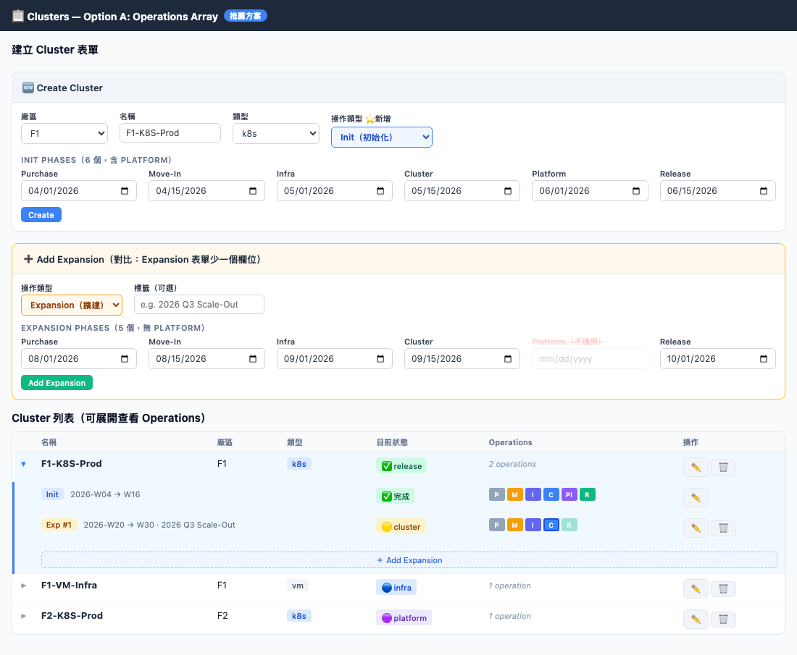
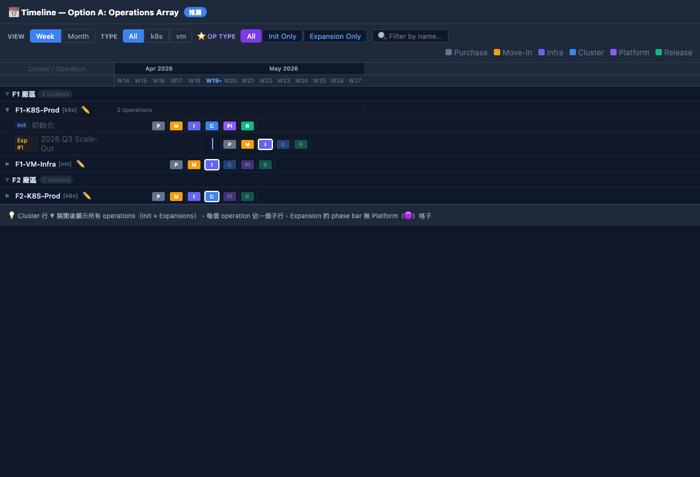
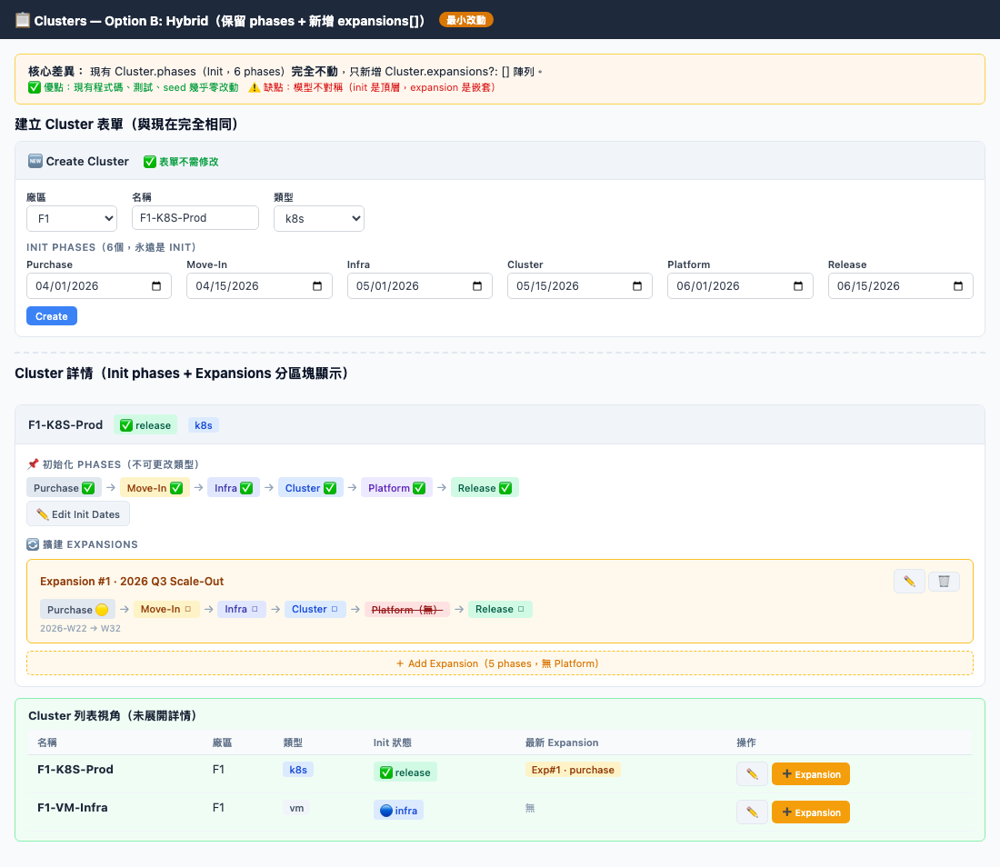
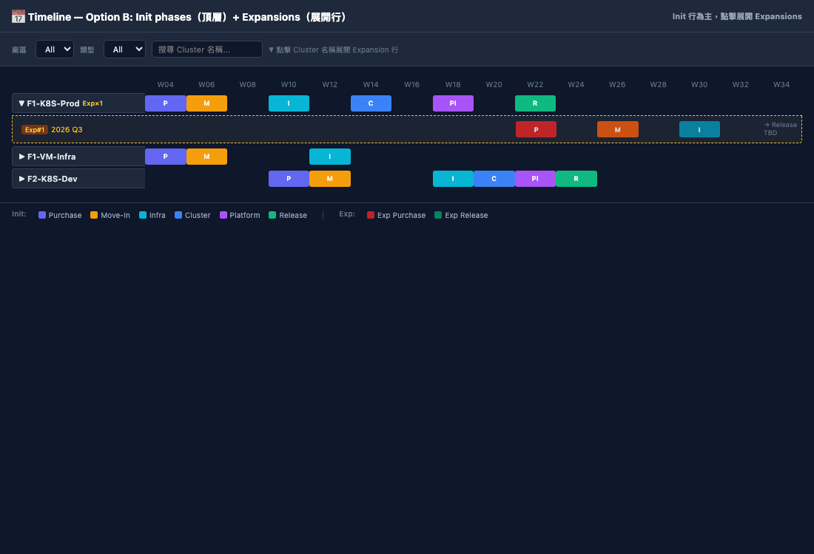
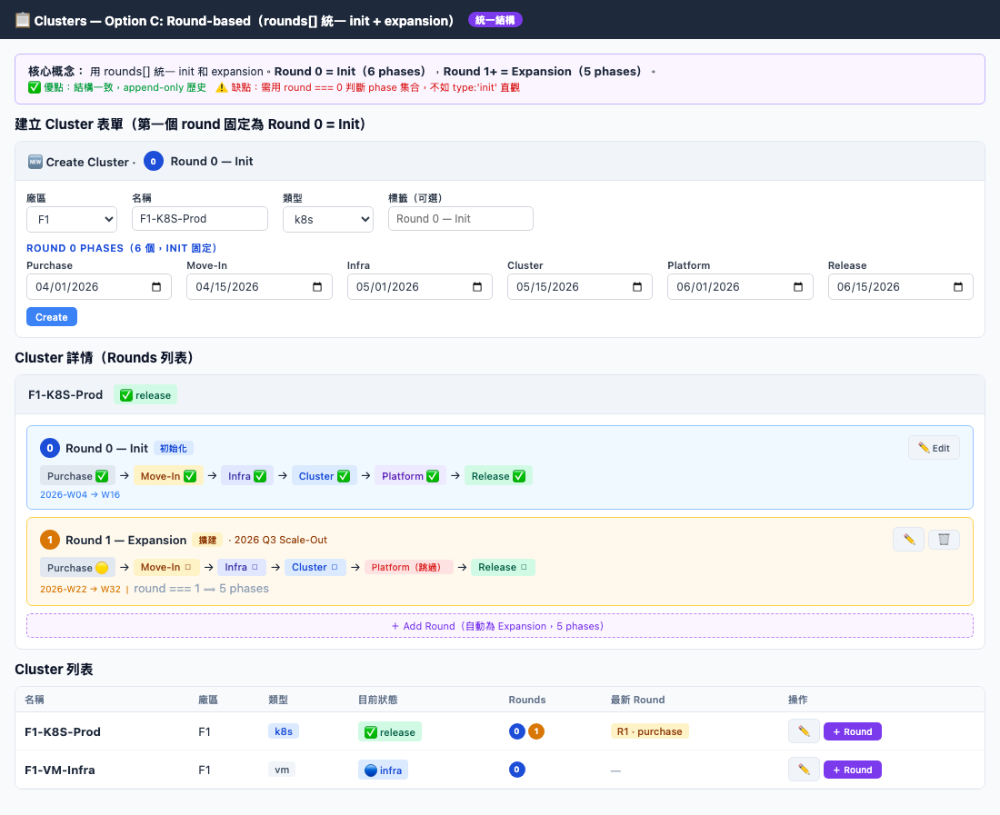
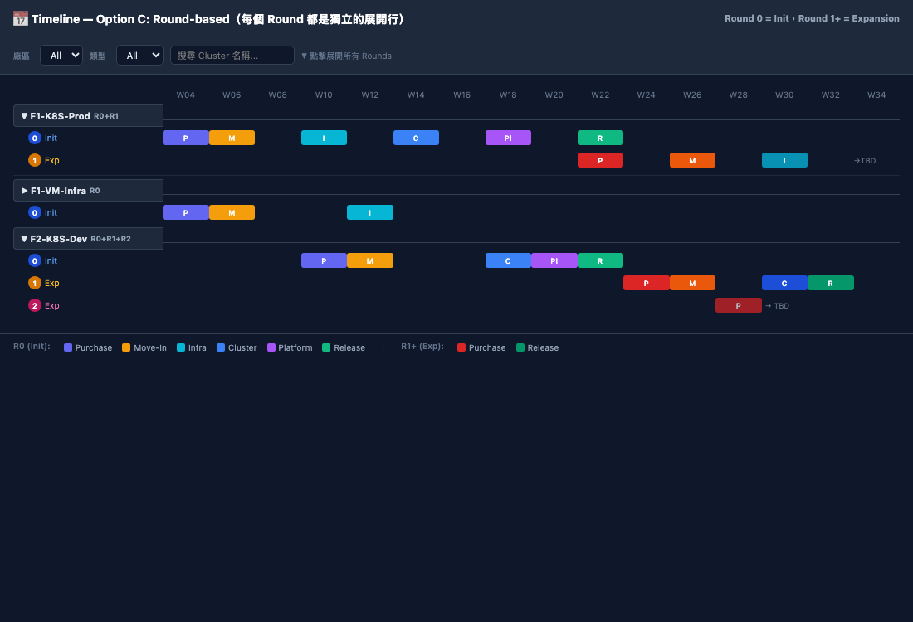
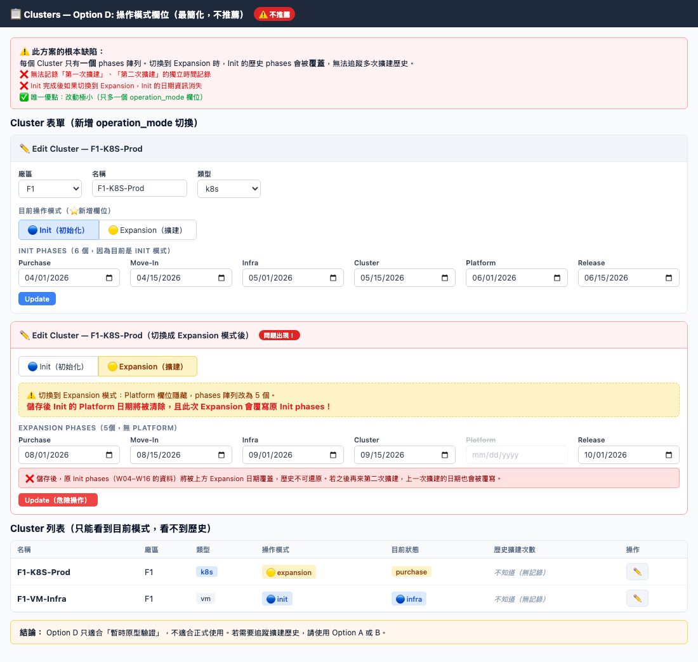
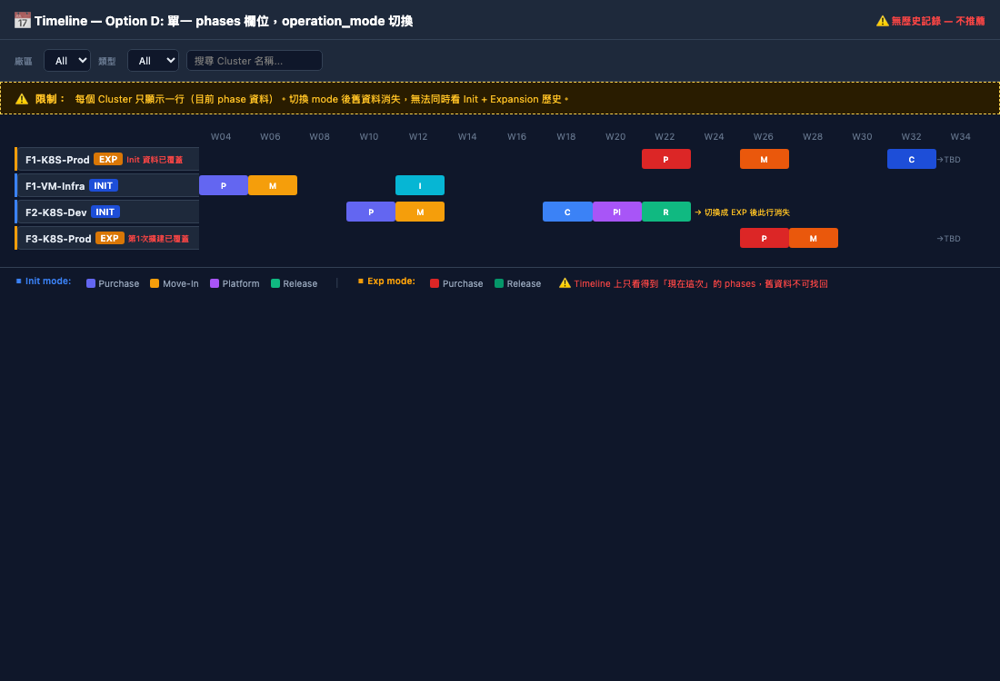

# Cluster Operations Design Plan

## Background

每個 Cluster 未來需要支援兩種「操作類型」：

| 操作類型 | 次數 | Phase 序列 |
|--------|------|-----------|
| **初始化 (Init)** | 一次 | Purchase → MoveIn → Infra → Cluster → **Platform** → Release |
| **擴建 (Expansion)** | 多次 | Purchase → MoveIn → Infra → Cluster → Release（無 Platform）|

初始化只發生一次（新建 Cluster 時）；擴建可以在初始化完成後反覆發生，每次擴建是獨立的一組 phases。

目前的資料結構：`Cluster.phases: ClusterPhase[]` 只支援單一 phase 序列，無法表達多次操作。

---

## 現況分析（需改動的範圍）

### Types (`src/types/index.ts`)
目前：
```ts
export type PhaseKey = ClusterStatus;
// = 'purchase' | 'movein' | 'infra' | 'cluster' | 'platform' | 'release'

export interface Cluster {
  phases?: ClusterPhase[];  // 單一 phase 序列
}
```

### Clusters 頁面 (`src/pages/Clusters.tsx`)
- 建立/編輯表單只有一組 6 個日期輸入
- Status 欄位顯示單一 ClusterStatus

### Timeline 頁面 (`src/pages/Timeline.tsx` + `src/timeline/`)
- 每個 Cluster 只有一行
- ClusterEditDrawer 只編輯一組 phases

---

## 設計選項

---

### Option A：Operations 陣列（推薦）

#### 資料模型

每個 Cluster 新增一個 `operations` 陣列，每筆 operation 有 type + 自己的 phases：

```ts
export type OperationType = 'init' | 'expansion';

export type InitPhaseKey = 'purchase' | 'movein' | 'infra' | 'cluster' | 'platform' | 'release';
export type ExpansionPhaseKey = 'purchase' | 'movein' | 'infra' | 'cluster' | 'release';

export interface ClusterOperation {
  id: string;
  type: OperationType;
  label?: string;          // e.g. "Expansion #1", "2026 Q3 Scale-Out"
  phases: ClusterPhase[];  // 6 phases if init, 5 phases if expansion
  created_at: string;
}

export interface Cluster {
  // ...existing fields
  operations?: ClusterOperation[];    // NEW - replaces top-level phases
  phases?: ClusterPhase[];            // DEPRECATED - kept for backward compat / migration
}
```

`ClusterStatus` 依然是 6-phase union（`platform` 仍然存在），但 expansion operation 的 phases 只含其中 5 個。

#### Clusters 頁面 UI

建立 Cluster 時，表單內有一個「Operation 類型」選擇（Init / Expansion），且根據類型顯示不同的 phase 日期輸入：
- Init：6 個日期（含 Platform）
- Expansion：5 個日期（無 Platform）

Cluster 列表行展開時，顯示 operations 清單：
```
▶ F1-K8S-Prod   [k8s]  [F1]  [release]
    Init (2026-W04 ~ W16) ✅
    Expansion #1 (2026-W20 ~ W30) 🟡 in_progress
    [+ Add Expansion]
```

每個 operation 可以獨立編輯/刪除（init 不可刪除）。

#### Timeline 頁面 UI

**方案 A1（operation = 獨立 row）**
每個 operation 都是 timeline 的一行，工廠群組下可能有多行同一 cluster：
```
F1 廠區
  F1-K8S-Prod  [Init    ]  [🛒][📦][⚙️][🔧][🟣][🟢]
  F1-K8S-Prod  [Exp #1  ]  ←→←→  [🛒][📦][⚙️][🔧][🟢]
  F1-K8S-Prod  [Exp #2  ]           ←→←  [🛒][📦][⚙️]...
```
左側欄顯示 `ClusterName / OperationLabel`，顏色有輕微區分（init = 深色，expansion = 較淡）。

**方案 A2（cluster = 一行，operations = 展開的子行）**
Cluster 行是 collapsible 的 parent，點開後可以看到每個 operation 的 phase bar：
```
▼ F1-K8S-Prod  ●release
    Init     [🛒][📦][⚙️][🔧][🟣][🟢]
    Exp #1   [🛒][📦][⚙️][🔧][🟢]
    Exp #2   [🛒][📦]...
```
這樣 Timeline 不會因為多次 expansion 爆炸性膨脹。

**推薦：A2**（預設收起，只顯示最新 operation 的 phase bar；點展開才看全部）

#### Timeline Toolbar 新增

- Type filter 新增「Init only」/ 「Expansion only」/ 「All」選項（目前 filter 是 k8s / vm）

#### 優點
- 乾淨的 append-only 歷史記錄
- 可以很清楚地追蹤每次擴建的時間
- Init 和 Expansion 有明確的 type 區分，TypeScript 型別安全

#### 缺點
- 需要改動的程式碼範圍最大（types、store、seed、Clusters、Timeline）
- Clusters 頁面需要 row expansion UI

#### 畫面預覽

**Clusters 頁面（建立表單 + 展開 Operations）：**


**Timeline 頁面（Cluster 為 parent row，點擊展開 operations 子行）：**


---

### Option B：Hybrid（保留 init phases，新增 expansions 陣列）

#### 資料模型

保留目前 `Cluster.phases` 作為 init phases，新增 `expansions` 陣列：

```ts
export interface ClusterExpansion {
  id: string;
  label?: string;
  phases: ClusterPhase[];  // 5 phases: purchase, movein, infra, cluster, release
  created_at: string;
}

export interface Cluster {
  phases?: ClusterPhase[];           // init (不變，向後兼容)
  expansions?: ClusterExpansion[];   // NEW
}
```

#### 優點
- **向後兼容性最高** — 現有程式碼、測試、seed 幾乎不需改動
- 改動範圍最小：只需在 store、Clusters、Timeline 新增 expansion 的 CRUD

#### 缺點
- 模型不對稱（init 是頂層 phases，expansion 是嵌套陣列）
- `status` 欄位（目前只反映 init status）需要決定如何表達 expansion in-progress 狀態

#### 畫面預覽

**Clusters 頁面（Init phases 不動，Expansion 作為嵌套區塊）：**


**Timeline 頁面（Init 為主行，Expansion 為展開子行）：**


---

### Option C：Round-based model

#### 資料模型

用「round」概念統一 init 和 expansion，round 0 永遠是 init：

```ts
export interface ClusterRound {
  round: number;        // 0 = init, 1+ = expansion
  label?: string;
  phases: ClusterPhase[];
}

export interface Cluster {
  rounds?: ClusterRound[];
  phases?: ClusterPhase[];   // legacy，只在 rounds 為空時使用
}
```

#### 優點
- 統一的陣列結構，init 和 expansion 用同一個介面
- 自然地從 round 0 延伸到 round N

#### 缺點
- `round: number` 作為 type discriminator 不如 `type: 'init' | 'expansion'` 清晰
- Timeline 和 Clusters 頁面的邏輯需要 check `round === 0` 來決定 phase 集合

#### 畫面預覽

**Clusters 頁面（Rounds 列表，Round 0 = Init，Round 1+ = Expansion）：**


**Timeline 頁面（每個 Round 是獨立展開行）：**


---

### Option D：Operation type 作為 Cluster 的模式（最簡化）

**不記錄歷史，只記錄「目前正在進行的操作類型」**

```ts
export interface Cluster {
  operation_mode?: 'init' | 'expansion';   // 目前是 init 還是 expansion
  phases?: ClusterPhase[];  // 根據 operation_mode 決定有幾個 phase
}
```

#### 優點
- 改動最少
- 適合初期快速原型

#### 缺點
- 無法同時追蹤多次 expansion 的歷史
- 不符合「擴建會有很多次」的需求
- **不推薦** — 僅適合作為暫時過渡

#### 畫面預覽

**Clusters 頁面（operation_mode 切換，Init ↔ Expansion 覆蓋 phases）：**


**Timeline 頁面（每個 Cluster 只有一行，歷史無法追蹤）：**


---

## 推薦方案

**Option A（Operations 陣列）+ Timeline UI 採用 A2（cluster 行可展開子行）**

理由：
1. 符合業務語意——每次 init / expansion 都是獨立的「事件」，需要完整追蹤
2. TypeScript 型別清晰，`OperationType` 明確區分兩種 phase 集合
3. Timeline A2 UI 讓每個 Cluster 預設只佔一行（不爆炸），仍可展開查看歷史
4. 向後兼容：可以在 store 的 migration 中把現有 `phases` 轉成 `operations[0]`（type: 'init'）

---

## 實作任務拆分（給 AI 實作用）

### Task 1: Types 更新 (`src/types/index.ts`)

新增：
```ts
export type OperationType = 'init' | 'expansion';

// Init uses all 6 phases; Expansion omits 'platform'
export const INIT_PHASES:      PhaseKey[] = ['purchase','movein','infra','cluster','platform','release'];
export const EXPANSION_PHASES: PhaseKey[] = ['purchase','movein','infra','cluster','release'];

export interface ClusterOperation {
  id: string;
  type: OperationType;
  label?: string;
  phases: ClusterPhase[];
  created_at: string;
}
```

修改 `Cluster` interface：
```ts
export interface Cluster {
  // ...existing fields unchanged
  operations?: ClusterOperation[];   // NEW
  phases?: ClusterPhase[];           // KEEP for backward compat (migration source)
}
```

修改 `ClusterStatus`：保留目前 6 個值不變（`platform` 仍存在，只是 expansion 不走這步）。

---

### Task 2: Store 更新 (`src/mock/store.ts`)

1. Bump localStorage key: `mosite_mock_db_v5` → `mosite_mock_db_v6`
2. Migration: 讀取舊 v5 資料時，若 cluster 有 `phases` 但沒有 `operations`，自動轉換：
   ```ts
   cluster.operations = [{ id: uuid(), type: 'init', phases: cluster.phases, created_at: cluster.created_at }];
   ```
3. 新增 CRUD functions：
   - `db_addOperation(clusterId, operation)` — 新增 init 或 expansion
   - `db_updateOperation(clusterId, operationId, phases)` — 更新某次操作的 phases
   - `db_deleteOperation(clusterId, operationId)` — 刪除（不允許刪除 init）
4. `deriveClusterStatus` 保持不變，但呼叫端傳入的是「最新 active operation」的 phases

---

### Task 3: API 更新 (`src/api/clusters.ts`)

新增：
```ts
export async function addOperation(clusterId: string, data: CreateOperationData): Promise<Cluster>
export async function updateOperation(clusterId: string, operationId: string, phases: ClusterPhase[]): Promise<Cluster>
export async function deleteOperation(clusterId: string, operationId: string): Promise<void>
```

---

### Task 4: Clusters 頁面 (`src/pages/Clusters.tsx`)

1. **建立 Cluster 表單**新增「Operation 類型」選擇（Init / Expansion）：
   - Init：顯示 6 個 date input（含 Platform）
   - Expansion：顯示 5 個 date input（無 Platform）
   - 建立時的第一個 operation 必須是 Init（強制）

2. **Cluster 列表行**改為可展開：
   - 預設顯示：cluster 基本資訊 + 目前最新 operation 的 status badge
   - 展開後顯示所有 operations 清單，每筆 operation 可點編輯/刪除（非 init）
   - 展開行底部有「+ Add Expansion」按鈕

3. **驗證邏輯**：
   - Init 只能有一個（建立第一個 operation 時強制為 init；後續 Add 按鈕只能新增 expansion）
   - Expansion phases 驗證：使用 `EXPANSION_PHASES`（5 個，無 platform）

---

### Task 5: Timeline 頁面 (`src/timeline/` + `src/pages/Timeline.tsx`)

1. **`ClusterRow.tsx`** 改為展開式：
   - 預設顯示：cluster 名稱 + 最新 operation 的 phase bar
   - 點擊後展開所有 operations（每個 operation = 一行 phase bar）
   - 展開時子行左側顯示 operation label（Init / Exp #1 / Exp #2...）

2. **`ClusterEditDrawer`** 更新：
   - 顯示 operation 選擇器（下拉或 tabs）：選哪個 operation 就編輯哪個的 phases
   - Init operation = 6 個 date input；Expansion = 5 個 date input（無 Platform）

3. **Timeline toolbar**（`TimelineToolbar.tsx`）新增 operation type filter：
   - 選項：All / Init Only / Expansion Only
   - 套用後，clusters 只顯示有對應 operation 類型的資料行

4. **`buildWeekColumns` / `buildMonthColumns`** 不需改動（只依賴 date 值）

---

### Task 6: Seed 資料更新 (`src/mock/seed.ts`)

更新所有 26 個 clusters：
- 將 `phases` 改為 `operations: [{ id, type: 'init', phases: [...], created_at }]`
- 選 3~5 個 cluster 新增 1~2 個 expansion operations（使用 5-phase set）作為示範資料

---

### Task 7: 測試更新

- `src/mock/store.test.ts`：更新 migration 測試（v5→v6）、新增 addOperation / deleteOperation 測試
- `src/pages/Clusters.test.tsx`：更新建立 cluster 測試（選 init type）、新增 expansion 建立測試
- `src/timeline/utils.test.ts`：不需大改（pure functions 邏輯不變）

---

## 關鍵決策記錄

| 決策 | 選擇 | 理由 |
|------|------|------|
| Init 的 phases 數量 | 6（含 platform）| 不變 |
| Expansion 的 phases 數量 | 5（無 platform）| 擴建不需要 Platform Team |
| `ClusterStatus` 型別 | 保留 6-phase union | platform 仍是有效狀態（for init clusters） |
| Timeline row 策略 | Cluster = parent，operations = 子行 | 避免 row 數爆炸 |
| Operation 識別 | `type: 'init' \| 'expansion'` | 明確，比 `round: number` 清晰 |
| 向後兼容 | v5→v6 migration 自動轉換 | 現有測試和種子資料可平滑升級 |
| Init 唯一性 | 前端驗證（store 也 guard） | 一個 Cluster 只能有一個 init operation |

---

## 相關檔案清單

```
src/types/index.ts                   — 型別定義（Task 1）
src/mock/store.ts                    — MockDB CRUD + migration（Task 2）
src/mock/seed.ts                     — 種子資料（Task 6）
src/api/clusters.ts                  — API client（Task 3）
src/pages/Clusters.tsx               — Clusters CRUD 頁面（Task 4）
src/pages/Timeline.tsx               — Timeline 主頁面（Task 5）
src/timeline/ClusterRow.tsx          — Timeline 每行（Task 5）
src/timeline/FactoryGroup.tsx        — 工廠群組（Task 5，minor）
src/timeline/TimelineToolbar.tsx     — Filter bar（Task 5）
src/timeline/utils.ts                — Pure functions（Task 5，minor）
src/mock/store.test.ts               — Store 測試（Task 7）
src/pages/Clusters.test.tsx          — Clusters UI 測試（Task 7）
```
